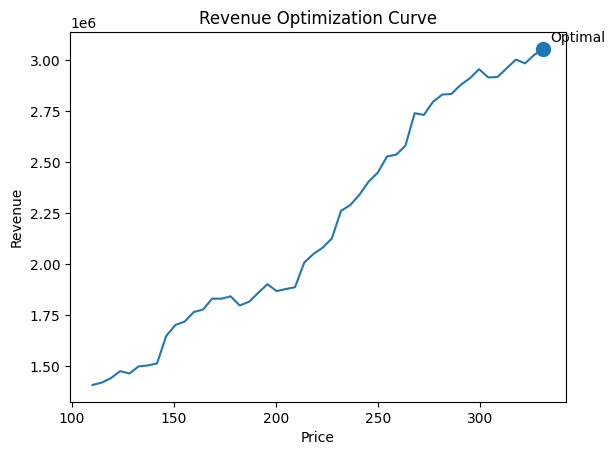
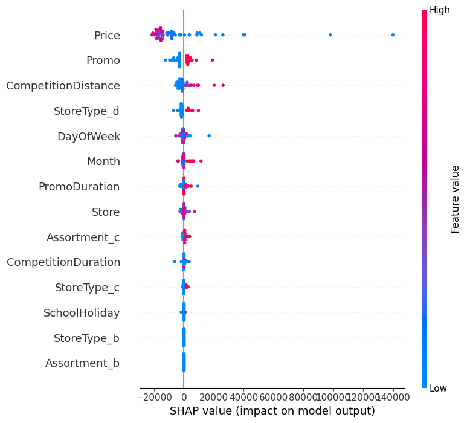
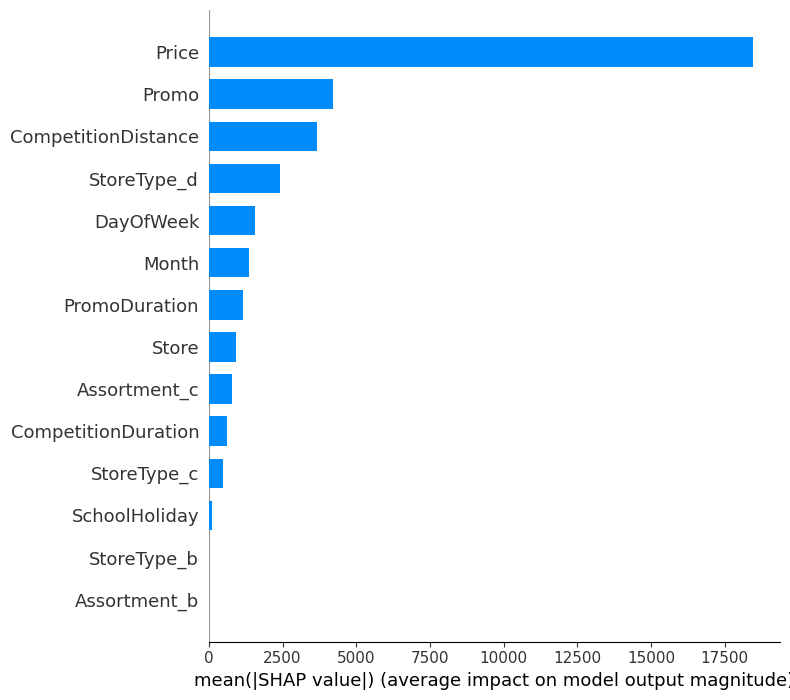
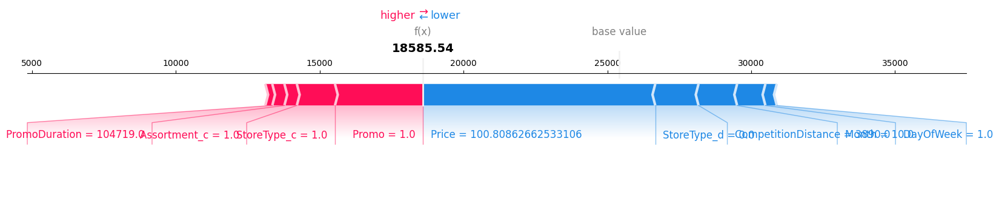

# 💰 Dynamic Price Optimization System

## 🚀 Overview

An ML-powered pricing assistant that recommends optimal prices by simulating demand and revenue, helping businesses make data-driven pricing decisions.

## 📸 Preview



## 🎯 Problem Statement

Pricing is one of the most critical decisions in business, yet many systems still rely on fixed rules or intuition.  
This often leads to missed revenue opportunities because demand changes with price, promotions, competition, and seasonality.

## 💡 Solution

This project builds an end-to-end pricing optimization system that:

- 📈 Predicts demand based on business conditions
- 💰 Simulates multiple price points
- 🎯 Identifies the price that maximizes revenue
- 🔍 Explains the recommendation using visual and feature-based insights

## ⚙️ Key Features

### 📈 Revenue Optimization Curve

- Visualizes the relationship between price and revenue
- Highlights the optimal price point
- Helps users understand why a recommendation was made

### 🔍 Explainable Pricing

- Converts model behavior into simple, human-readable insights
- Highlights the main drivers behind the recommendation:
  - 💲 Price sensitivity
  - 🏷️ Promotions
  - 🏪 Competition

### ⚖️ A/B Price Comparison

- Compares different pricing strategies such as ₹300 vs ₹400
- Shows:
  - 📊 Mean revenue
  - 📉 Risk (variability in outcomes)

### 🟡 Confidence Indicator

- Displays confidence levels (High / Moderate / Low)
- Helps users assess reliability of recommendations

## 🧠 Machine Learning Model

- **Model:** XGBoost Regressor
- **Task:** Demand Prediction
- **Output:** Predicted sales used for revenue optimization

## 🛠️ Tech Stack

- 🐍 Python
- 🌐 Streamlit
- ⚡ XGBoost
- 📊 Pandas
- 🔢 NumPy
- 📈 Matplotlib
- 🧩 SHAP
- 💾 Joblib

## 📊 Model Insights

### Feature Importance (SHAP)
<p align="center">
  
</p>

### Feature Impact
<p align="center">
  
</p>
<p align="center">
  
</p>


## 📌 How It Works

```
User Input
↓
Feature Processing
↓
Demand Prediction
↓
Price Simulation
↓
Revenue Calculation
↓
Optimal Price Selection
↓
Visualization + Explanation
```

This pipeline ensures pricing decisions are driven by predicted demand and revenue maximization rather than intuition.

## 📥 Input Features

### Demand Drivers

- Day of Week
- Promotions
- Holidays
- Seasonality

### Market Factors

- Competition Distance

### Store Characteristics

- Store Type
- Assortment

### Pricing

- Current Price

## 📤 Output

The system delivers actionable insights:

- ✅ Optimal price recommendation
- 💰 Expected revenue at optimal price
- 📈 Revenue curve for decision support
- 🔍 Clear explanation of key drivers
- 🟡 Confidence level
- ⚖️ Comparison between pricing strategies

## 🖥️ Run Locally

```bash
git clone https://github.com/Aakriti-Singh01/dynamic-price-optimizer.git
cd dynamic-price-optimizer

python -m venv venv
venv\Scripts\activate

pip install -r requirements.txt

streamlit run app/streamlit_app.py
```

## 📁 Project Structure

```
dynamic-price-optimizer/
│
├── app/
│   └── streamlit_app.py
│
├── src/
│   ├── price_optimizer.py
│   ├── simulation.py
│   ├── explainability.py
│
├── models/
│   └── xgb_model.pkl
│
├── assets/
│   ├── shap_summary.png
│   ├── shap_bar.png
│   └── revenue_curve.png
│
├── notebooks/
│   └── exploration.ipynb
│
├── requirements.txt
└── README.md
```

## 📌 Why This Project Matters

Pricing directly impacts revenue, yet it is often under-optimized.  
This project demonstrates how machine learning can transform pricing into a strategic, data-driven decision rather than guesswork.

## 🚀 Future Improvements

- 🔗 Real-time pricing API (FastAPI)
- 📈 Advanced elasticity modeling
- 🧮 Multi-product optimization
- 🔄 Integration with live data
- 🤖 Automated retraining pipeline

## 💼 Project Highlights

- ✅ End-to-end ML pipeline (data → model → UI)
- ✅ Real-world business problem
- ✅ Explainable AI integration
- ✅ Decision-focused product design
- ✅ Modular, production-ready code

## 🎯 Final Outcome

**👉 Pricing Decision Assistant that helps businesses make smarter, data-driven pricing decisions.**

## 👤 Author

**Aakriti Singh**  
 Artificial Intelligence & Data Science  
 Machine Learning
